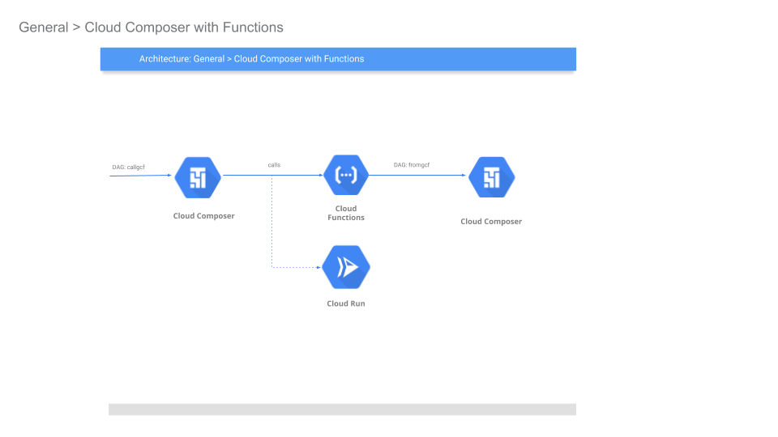
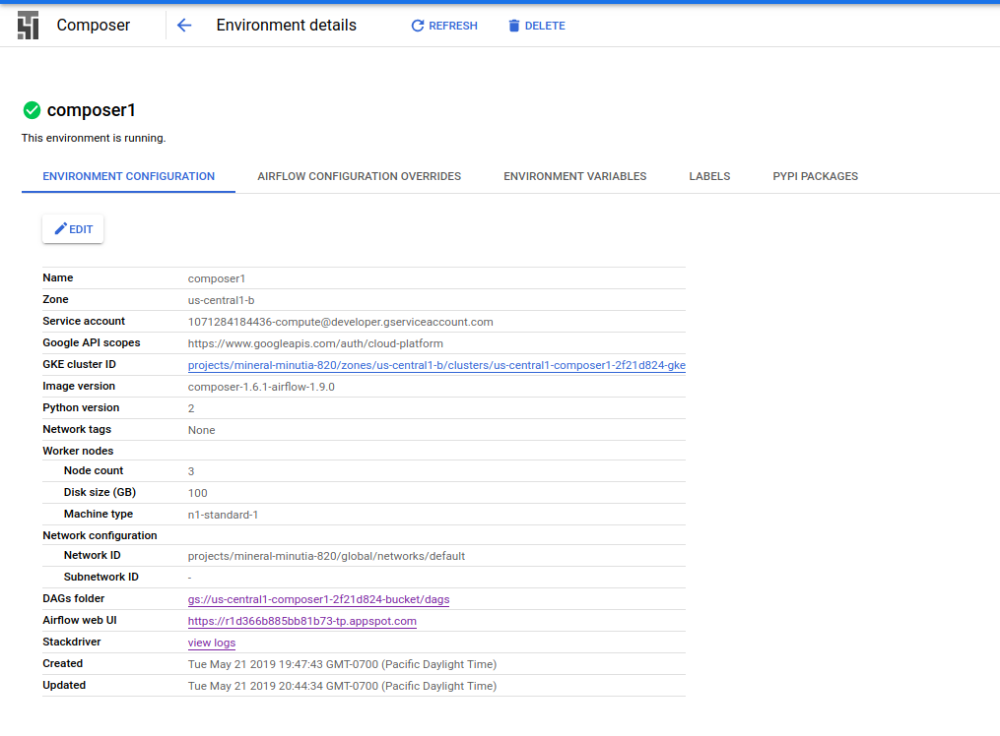
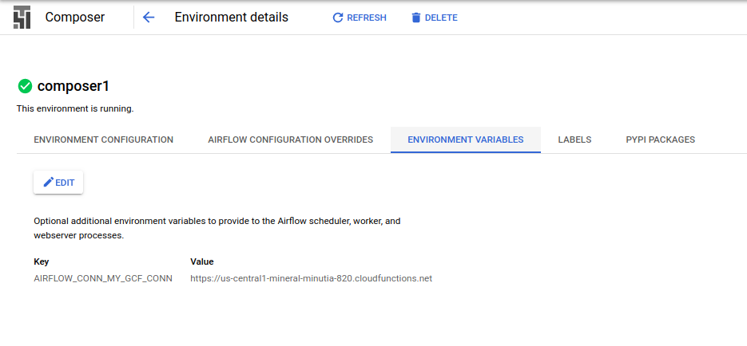
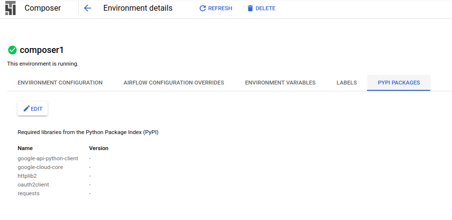
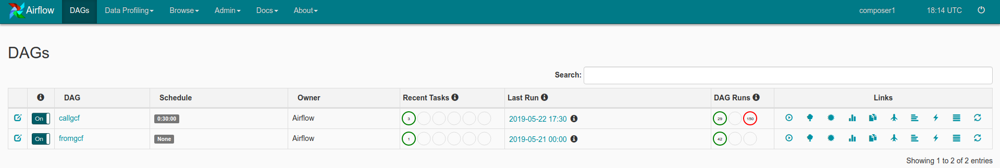
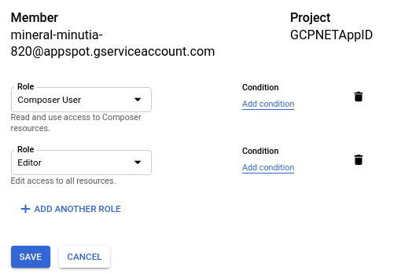
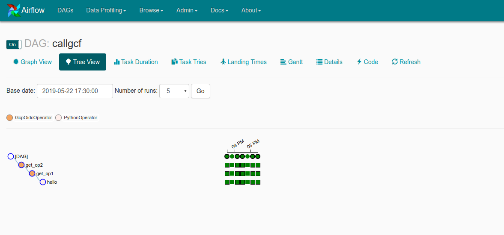
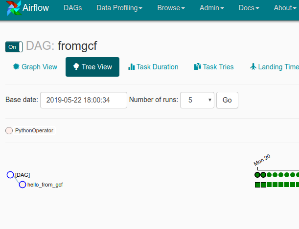

Sample [Cloud Composer](https://cloud.google.com/composer/docs/) (Apache Airflow) configuration to securely invoke [Cloud Functions](https://cloud.google.com/functions/docs/) or [Cloud Run](https://cloud.google.com/run/docs/).

In addition this sample shows inverse:  how Cloud Functions can invoke a Composer DAG securely.  While `GCF->Composer` is documented [here](https://cloud.google.com/composer/docs/how-to/using/triggering-with-gcf), the configuration detailed here is minimal and (to me), easier to read.
   




Anyway, the following will setup cloud composer, then we will trigger composer to invoke a cloud function...the cloud function will just trigger a different cloud composer endpoint....you can make it cycle back and eat its tail...

### 1. Create Composer Environment


```bash
export GOOGLE_PROJECT_ID=`gcloud config get-value core/project`
export PROJECT_NUMBER=`gcloud projects describe $GOOGLE_PROJECT_ID --format='value(projectNumber)'`

gcloud composer environments create composer1  --location us-central1 

gcloud composer environments  list --locations us-central1
```


### 2. Add Python Packages and GCF Connection URL

The following steps sets up Airflow connections we will use internally.  The commands below describes a URL to a GCF function we will enable later.

- Configure `requirements.txt`
```
gcloud composer environments update composer1  \
  --update-pypi-packages-from-file requirements.txt --location us-central1
```

- Configure connection
```
gcloud composer environments update composer1  \
  --update-env-variables=AIRFLOW_CONN_MY_GCF_CONN=https://us-central1-$GOOGLE_PROJECT_ID.cloudfunctions.net --location us-central1
```

> Note: each of these commands takes ~10mins; go grab a coffee.


- Verify configurations via cli and on the Cloud Console for Composer

```
gcloud composer environments describe composer1 --location us-central1
```

The following will list the default GCS bucket used for its configurations and DAG storage
```
gcloud composer environments describe composer1 --location us-central1 --format="get(config.dagGcsPrefix)"
```

- You can now open up the [Airflow GUI](https://cloud.google.com/composer/docs/how-to/accessing/airflow-web-interface)

and also see the GCP Console:

- Config:


- Env


- Python Packages



### 3.  Identify the client_id used by IAP 

Cloud Composer is shielded by Cloud Identity Aware proxy.  The following command will identify the oauth2 `client_id` it uses which we will later need to trigger DAGs externally from GCF.  For refrerence, see [triggering with gcf](https://cloud.google.com/composer/docs/how-to/using/triggering-with-gcf)


- Get ariflow URL:
 
If you are an Editor on the project running Airflow, you should have `Editor` rights to invoke the endpoint:

(the follwing command uses `jq` cli to parse JSON)

```bash
$ curl -s  -H "Authorization: Bearer `gcloud auth print-access-token`" https://composer.googleapis.com/v1beta1/projects/$GOOGLE_PROJECT_ID/locations/us-central1/environments/composer1 | jq [.config.airflowUri]
```

In my case, the URL for Airflow is:
```json
[
  "https://r1d366b885bb81b73-tp.appspot.com"
]
```

- Use the URL to extract the client ID

Attempt to make an unauthenticated call to the URL.  You should see an error but within the curl output you will find the elusive `client_id`:

```bash
curl -v https://r1d366b885bb81b73-tp.appspot.com
```

eg, in my case the command above showed
```
location: https://accounts.google.com/o/oauth2/v2/auth?client_id=491562778408-sj8hb4035bp7ui918ra0i9qbhbqnejk1.apps.googleusercontent.com&response_type=code&scope=openid+email&redirect_uri=https://r1d366b885bb81b73-tp.appspot.com/_gcp_gatekeeper/authenticate&cred_ref=true&state=CilodHRwczovL3IxZDM2NmI4ODViYjgxYjczLXRwLmFwcHNwb3QuY29tLxIwQU91REJvbndMSlJlOEJ3aTBkaDBZeXdlbktYSTBxNVpxdzoxNTU4NTE0MzgyMzc4
```

which means the `client_id` is `491562778408-sj8hb4035bp7ui918ra0i9qbhbqnejk1.apps.googleusercontent.com`


Note the client_id and composer_url:

```bash
target_audience = `491562778408-sj8hb4035bp7ui918ra0i9qbhbqnejk1.apps.googleusercontent.com`
url = `https://r1d366b885bb81b73-tp.appspot.com`
```

### 4. Deploy DAGs

- Deploy the DAG that _sends_ authenticated calls to GCF:

Edit `to_gcf.py` and replace the following line with your projectID 
```
target_audience = 'https://us-central1-$GOOGLE_PROJECT_ID.cloudfunctions.net/echo_app_python'
```
then
```
gcloud composer environments storage dags import --environment composer1  --location us-central1   --source to_gcf.py
```

- Deploy the DAG that _receives_ authenticated calls from GCF:

```
gcloud composer environments storage dags import --environment composer1  --location us-central1   --source from_gcf.py
```



### 5. Deploy GCF

Edit `main.py` and update  `target_url` and `url` with the values from **step 3**:

in my case:

```python
    target_audience = '491562778408-sj8hb4035bp7ui918ra0i9qbhbqnejk1.apps.googleusercontent.com'
    url = 'https://r1d366b885bb81b73-tp.appspot.com'
```

then deploy

```
gcloud functions deploy  echo_app_python --region=us-central1
```

### 6. Set IAM Permissions

Now set IAM permissions to

### Allow Composer to call GCF

When we setup composer, we did not specify the serivce account it should run as.  By default, it will use the compute engine service account which is in the form:

```
$PROJECT_NUMBER-@developer.gserviceaccount.com
```

the apply:

```
gcloud alpha functions add-iam-policy-binding echo_app_python  \
    --member serviceAccount:$PROJECT_NUMBER-compute@developer.gserviceaccount.com   --role roles/cloudfunctions.invoker
```

### Allow GCF to call Composer

During our setup of Cloud Functions, we did not specify a service account.  By default GCF will use an account in the form:

```
$GOOGLE_PROJECT_ID@appspot.gserviceaccount.com
```

so using that, go to the Cloud Consoles IAM page and for that account, add the `Composer User` IAM role



GCF invokes a DAG directly using the  [Experimental Rest Endpoint](https://airflow.apache.org/api.html#experimental-rest-api)

### 7. Invoke DAG directly

The default DAG `callgcf` DAG is set to run every 30minutes.  However, you can invoke it directly if you want via the UI or CLI:

- [CLI](https://cloud.google.com/composer/docs/how-to/accessing/airflow-cli#running_airflow_cli_commands)

On the console, you should see invocation back and forth:

- `callgcf`:


- `fromgcf`:


## References
- [Automatic oauth2: Using Cloud Scheduler and Tasks to call Google APIs](https://medium.com/google-cloud/automatic-oauth2-using-cloud-scheduler-and-tasks-to-call-google-apis-55f0a8905baf)
- [Automatic OIDC: Using Cloud Scheduler, Tasks, and PubSub to make authenticated calls to Cloud Run, Cloud Functions or your Server](https://medium.com/google-cloud/automatic-oidc-using-cloud-scheduler-tasks-and-pubsub-to-make-authenticated-calls-to-cloud-run-de9e7e9cec3f)


- [Composer Default Connections](https://cloud.google.com/composer/docs/how-to/managing/connections#default-connections)
- [Airflow: Authenticating to GCP APIs](https://airflow.apache.org/howto/connection/gcp.html#authenticating-to-gcp)
   Note: the tokens provided by `google_cloud_default` are `access_tokens` intended to _invoke_ GCP API; they cannot be used to access Cloud Run or GCF endpoints
- [Airflow: gcp_api_base_hook.py](https://github.com/apache/airflow/blob/master/airflow/contrib/hooks/gcp_api_base_hook.py)


---

### Appendix

The following snippets details how to invoke the DAG directly using a service_account json file. 

Note:  you must first allow that service accout IAM permissions the  `Composer User` first


- service_account_dag.py

```python
from google.oauth2 import id_token
from google.oauth2 import service_account
import google.auth
import google.auth.transport.requests
from google.auth.transport.requests import AuthorizedSession

target_audience = '491562778408-sj8hb4035bp7ui918ra0i9qbhbqnejk1.apps.googleusercontent.com'

url = 'https://r1d366b885bb81b73-tp.appspot.com/api/experimental/dags/callgcf/dag_runs'
certs_url='https://www.googleapis.com/oauth2/v1/certs'

additional_claims = { }

creds = service_account.IDTokenCredentials.from_service_account_file(
        '/path/to/svc.json',
        target_audience= target_audience, additional_claims=additional_claims)

authed_session = AuthorizedSession(creds)

# make authenticated request
headers = {
   "conf": ""
}
r = authed_session.post(url, headers=headers)

print r.status_code
print r.text


# verify
request = google.auth.transport.requests.Request()
idt = creds.token
print idt
print id_token.verify_token(idt,request,certs_url=certs_url)
```

- curl
```
$ curl -X POST -d '{"conf":""}' -H "content-type: application/json" -H "Authorization: Bearer $ID_TOKEN"  
{
  "message": "Created <DagRun callgcf @ 2019-05-22 09:11:46: manual__2019-05-22T09:11:46, externally triggered: True>"
}
```
