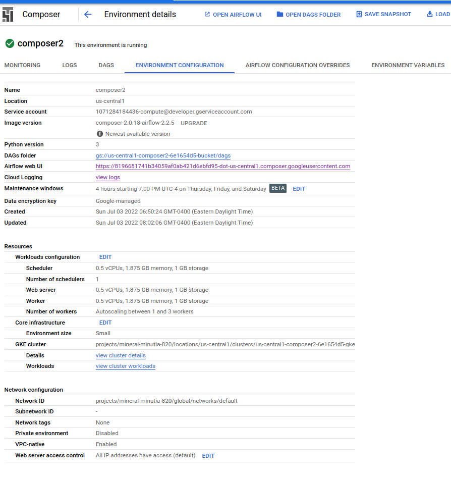
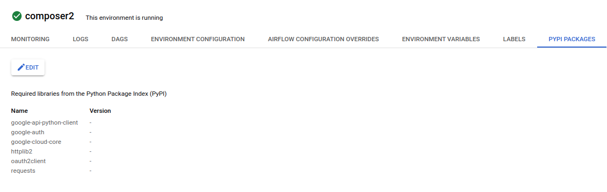
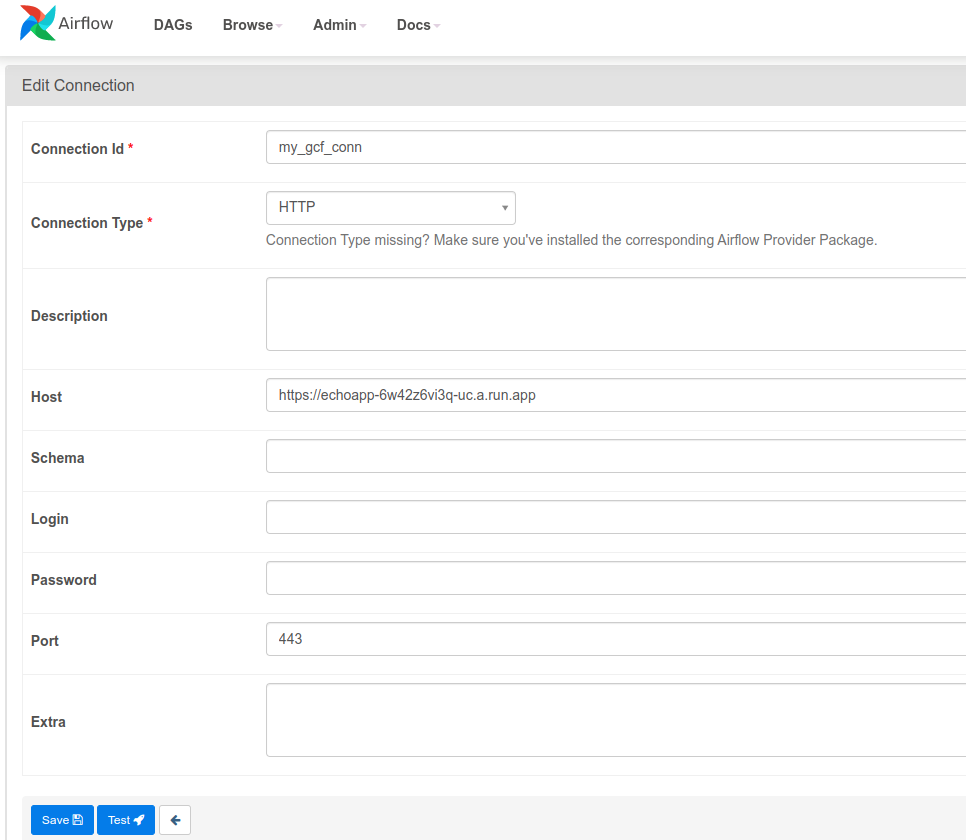
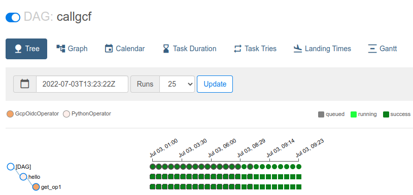
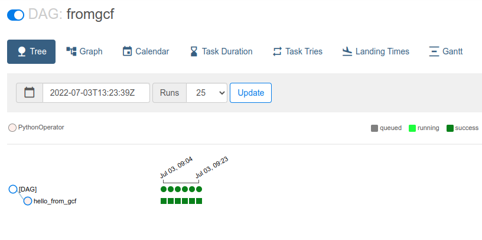

## Calling Cloud Composer to Cloud Functions and back again, securely

Sample [Cloud Composer 2](https://cloud.google.com/composer/docs/) (Apache Airflow) configuration to securely invoke [Cloud Functions](https://cloud.google.com/functions/docs/) or [Cloud Run](https://cloud.google.com/run/docs/).

In addition this sample shows inverse:  how Cloud Functions can invoke a Composer DAG securely.  While `GCF->Composer` is documented [here](https://cloud.google.com/composer/docs/how-to/using/triggering-with-gcf), the configuration detailed here is minimal and (to me), easier to read.
   


Anyway, the following will setup cloud composer, then we will trigger composer to invoke a cloud function...the cloud function will just trigger a different cloud composer endpoint....you can make it cycle back and eat its tail...

---

Please see [Google ID Tokens](https://github.com/salrashid123/google_id_token)

This repo was updated for composer2.  If you want composer1, see the previous commits in this repo.

---
### 1. Create Composer 2 Environment

```bash
export PROJECT_ID=`gcloud config get-value core/project`
export PROJECT_NUMBER=`gcloud projects describe $PROJECT_ID --format='value(projectNumber)'`
export GCLOUD_USER=`gcloud config get-value core/account`

gcloud projects add-iam-policy-binding $PROJECT_ID \
    --member serviceAccount:service-$PROJECT_NUMBER@cloudcomposer-accounts.iam.gserviceaccount.com \
    --role roles/composer.ServiceAgentV2Ext

gcloud composer environments create composer2 \
    --location us-central1 \
    --image-version composer-2.0.18-airflow-2.2.5
```

### 2. Add Python Packages to Composer

The following steps sets up Airflow connections we will use internally. 

- Configure `requirements.txt`

```
cd composer_to_gcf/
gcloud composer environments update composer2  \
  --update-pypi-packages-from-file requirements.txt --location us-central1
```

The following will list the default GCS bucket composer uses, its API URL and the serviceAccount it uses

```bash
gcloud composer environments describe composer2 --location us-central1 --format="get(config.dagGcsPrefix)"

export COMPOSER_SA=`gcloud composer environments describe composer2 --location us-central1  --format="value(config.nodeConfig.serviceAccount)"`
echo $COMPOSER_SA

export TOKEN=`gcloud auth print-access-token`
export AIRFLOW_URI=`curl -s  -H "Authorization: Bearer $TOKEN"  \
   https://composer.googleapis.com/v1/projects/$PROJECT_ID/locations/us-central1/environments/composer2 | jq -r '.config.airflowUri'`
echo $AIRFLOW_URI
# in my case it was:
# https://8196681741b34059af0ab421d6ebfd95-dot-us-central1.composer.googleusercontent.com
```

You can now open up the [Airflow GUI](https://cloud.google.com/composer/docs/how-to/accessing/airflow-web-interface)

and also see the GCP Console:

- Config:


- Python Packages


### 3. Deploy GCF gen2

First create a new service account

```bash
gcloud iam service-accounts create gcf-composer
```

And deploy the GCF function using that SA

```bash
cd echo_app_python/
gcloud beta functions deploy  echoapp \
 --gen2 --runtime python38 --trigger-http --region=us-central1 \
 --no-allow-unauthenticated \
 --set-env-vars=AIRFLOW_URI=$AIRFLOW_URI \
 --service-account gcf-composer@$PROJECT_ID.iam.gserviceaccount.com

# Get the URL where gen2 is deployed
CR_URL=`gcloud run services describe echoapp --format="value(status.address.url)"`
echo $CR_URL
```

### 4. Allow Composer to invoke GCF

```bash
gcloud run services add-iam-policy-binding echoapp \
   --member="serviceAccount:$COMPOSER_SA"   --role="roles/run.invoker"
```

### 5. Allow GCF to invoke Composer

Authorize GCF by identifying the client id GCF will use to call Composer.  See [Access Airflow REST API using a service account](https://cloud.google.com/composer/docs/composer-2/access-airflow-api#gcloud).


```bash
export NUMERIC_USER_ID=`gcloud iam service-accounts describe \
  gcf-composer@$PROJECT_ID.iam.gserviceaccount.com \
  --format="value(oauth2ClientId)"`
echo $NUMERIC_USER_ID

gcloud auth application-default login

gcloud composer environments run composer2 \
    --location us-central1 \
    users create -- \
    -u accounts.google.com:NUMERIC_USER_ID \
    -e NUMERIC_USER_ID  \
    -f NUMERIC_USER_ID \
    -l - -r Op --use-random-password

# now allow gcf to invoke composer via IAM
 gcloud projects add-iam-policy-binding $PROJECT_ID  \
     --member serviceAccount:gcf-composer@$PROJECT_ID.iam.gserviceaccount.com \
     --role roles/composer.user
```


### 6. Update Composer Connection settings

Setup a conn object in composer that will call our endpoint

```bash
CR_URL=`gcloud run services describe echoapp --format="value(status.address.url)"`
echo $CR_URL
# in my case its https://echoapp-6w42z6vi3q-uc.a.run.app

gcloud composer environments update composer2  \
  --update-env-variables=AIRFLOW_CONN_MY_GCF_CONN=$CR_URL --location us-central1

gcloud composer environments run composer2  \
  --location us-central1 connections -- add  my_gcf_conn --conn-type=http \
  --conn-host="$CR_URL" --conn-port 443
```




### 4. Deploy DAGs

- Deploy the DAG that _sends_ authenticated calls to GCF:

Edit `to_gcf.py` and set the `target_audience` to the value of your CR endpoint `CR_URL`

```
target_audience = 'https://echoapp-6w42z6vi3q-uc.a.run.app'
```
then

```bash
gcloud composer environments storage dags import --environment composer2 \
   --location us-central1   --source to_gcf.py
```

- Deploy the DAG that _receives_ authenticated calls from GCF:

```bash
gcloud composer environments storage dags import --environment composer2 \
   --location us-central1   --source from_gcf.py
```


### 5. Invoke DAG directly

The default DAG `callgcf` DAG is set to run every 30minutes.  However, you can invoke it directly if you want via the UI or CLI:

- [CLI](https://cloud.google.com/composer/docs/how-to/accessing/airflow-cli#running_airflow_cli_commands)


```
gcloud composer environments run composer2    --location us-central1 dags -- trigger callgcf
```

On the console, you should see invocation back and forth:

- `callgcf`:


- `fromgcf`:


If you want to trigger using curl,

```bash
curl -H "Authorization: Bearer `gcloud auth print-access-token`" \
  -d '{"conf": {"key":"value"}}' -H "content-type: application/json" \
  $AIRFLOW_URI/api/v1/dags/fromgcf/dagRuns

```


### gRPC Support

If instead of HTTP, you want to invoke a Cloud Run gRPC service, thats much more complicated and not (as of 6/3/22), not possible with the [gRPC Airflow Operator](https://airflow.apache.org/docs/apache-airflow-providers-grpc/stable/connections/grpc.html)

This is because the [gRPC Operator](https://airflow.apache.org/docs/apache-airflow-providers-grpc/stable/_api/airflow/providers/grpc/operators/grpc/index.html) does not support the [Google ID Tokens](https://github.com/salrashid123/google_id_token).  It support service Account self-signed JWT  but not oidc tokens


One solution which requires a pull request upstream is to add a hook option [here](https://github.com/apache/airflow/blob/main/airflow/providers/grpc/hooks/grpc.py#L93) with something like the following.  The `audience` value needs to get provided as part of the conn object, i suspect 

```python
elif auth_type == "OIDC_GOOGLE":

    # target_audience = self._get_field("audience")
    target_audience = "https://grpc-server-6w42z6vi3q-uc.a.run.app"
    request = google.auth.transport.requests.Request()

    ## use ADC pref
    token = id_token.fetch_id_token(request, target_audience)
    id_creds = google.oauth2.credentials.Credentials(token=token)

    ## alternative if on GCE
    #id_creds = compute_engine.IDTokenCredentials(request=request, target_audience=target_audience, use_metadata_identity_endpoint=True)
    channel = google_auth_transport_grpc.secure_authorized_channel(id_creds, request, base_url)
```

i hardcoded the audience here to my cloud run instance but used the rest of the config as shown like this 


once thats' done, the dag is something like this where in the following the proto is from [here](https://github.com/salrashid123/terraform-provider-grpc-full/tree/main/example)

```python
    from echo_pb2 import EchoRequest, Middle
    from echo_pb2_grpc import EchoServerStub
    from airflow.providers.grpc.operators.grpc import GrpcOperator

    with models.DAG(
            'to_cr',
            schedule_interval=datetime.timedelta(minutes=5),
            default_args=default_dag_args) as dag:

        call_grpc_1 = GrpcOperator(task_id='task_id',
                                 stub_class=EchoServerStub,
                                 call_func='SayHello',
                                 grpc_conn_id='cr_grpc_conn',
                                 data={'request': EchoRequest(first_name='sal', last_name='mander', middle_name=Middle(name='a'))},
                                 log_response=True,
```

Alternatively, the operator mentions setting a `custom_connection_func`.  Note, the connection `cr_grpc_conn_default` uses the CUSTOM auth type


```python

import google.auth
from google.auth.transport.requests import AuthorizedSession

from typing import TYPE_CHECKING, Any, Callable, List, Optional, Sequence

from google.auth.transport import (
    grpc as google_auth_transport_grpc,
    requests as google_auth_transport_requests,
)

from echo_pb2 import EchoRequest, Middle
from echo_pb2_grpc import EchoServerStub

from airflow.providers.grpc.operators.grpc import GrpcOperator

default_dag_args = {
    'depends_on_past': False,
    'start_date': airflow.utils.dates.days_ago(2),
    'retries': 1,
    'retry_delay': datetime.timedelta(minutes=5),
}

class gconn:
    def getconn(self):
        target_audience = "https://grpc-server-6w42z6vi3q-uc.a.run.app"
        request = google.auth.transport.requests.Request()
        token = id_token.fetch_id_token(request, target_audience)
        id_creds = google.oauth2.credentials.Credentials(token=token)

        con = GrpcHook(grpc_conn_id='cr_grpc_conn_default')

        u = con.conn.host + ":" + str(con.conn.port)
        channel = google_auth_transport_grpc.secure_authorized_channel(id_creds, request, u)

        return channel

def callback(response: Any, context: "Context"):
    print(repr(response))
    return response

with models.DAG(
        'to_cr',
        schedule_interval=datetime.timedelta(minutes=5),
        default_args=default_dag_args) as dag:

    # https://airflow.apache.org/docs/apache-airflow-providers-grpc/stable/_api/airflow/providers/grpc/operators/grpc/index.html
    call_grpc_1 = GrpcOperator(task_id='task_id',
                             stub_class=EchoServerStub,
                             call_func='SayHello',
                             grpc_conn_id='cr_grpc_conn_default',
                             data={'request': EchoRequest(first_name='sal', last_name='mander', middle_name=Middle(name='a'))},
                             log_response=True,
                             custom_connection_func = gconn.getconn,
                             response_callback= callback
        )
    call_grpc_1
```

## References
- [Automatic oauth2: Using Cloud Scheduler and Tasks to call Google APIs](https://medium.com/google-cloud/automatic-oauth2-using-cloud-scheduler-and-tasks-to-call-google-apis-55f0a8905baf)
- [Automatic OIDC: Using Cloud Scheduler, Tasks, and PubSub to make authenticated calls to Cloud Run, Cloud Functions or your Server](https://medium.com/google-cloud/automatic-oidc-using-cloud-scheduler-tasks-and-pubsub-to-make-authenticated-calls-to-cloud-run-de9e7e9cec3f)


- [Composer Default Connections](https://cloud.google.com/composer/docs/how-to/managing/connections#default-connections)
- [Airflow: Authenticating to GCP APIs](https://airflow.apache.org/howto/connection/gcp.html#authenticating-to-gcp)
   Note: the tokens provided by `google_cloud_default` are `access_tokens` intended to _invoke_ GCP API; they cannot be used to access Cloud Run or GCF endpoints
- [Airflow: gcp_api_base_hook.py](https://github.com/apache/airflow/blob/master/airflow/contrib/hooks/gcp_api_base_hook.py)
